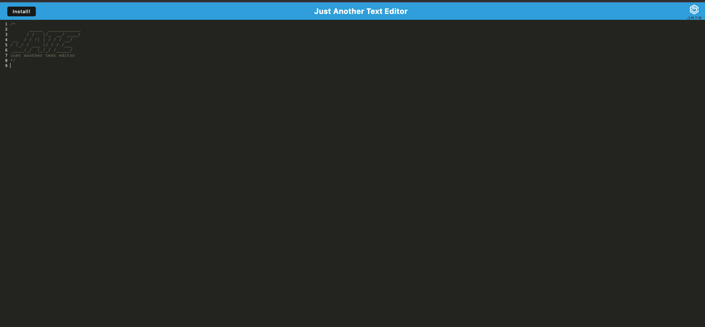

# Text Editor PWA

## Description

Provide a short description explaining the what, why, and how of your project. Use the following questions as a guide:

- The motivation for this project and why I built it was to create a progressive web application that looks and feels
like a native app that can work offline while still functioning like a web application, and can utilize a database
to persist data.

## Installation

Run 'npm run start' to start the application locally, or visit the link at the bottom of this page to go to the deployed version via heroku.

## Usage

## Credits

Torre Taylor helped me work through some errors.

## License

MIT

## Link to deployed application

https://murmuring-mesa-93026-b42e5abab10b.herokuapp.com/